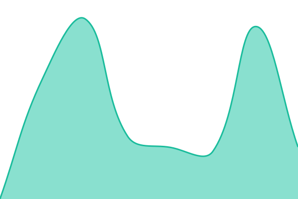
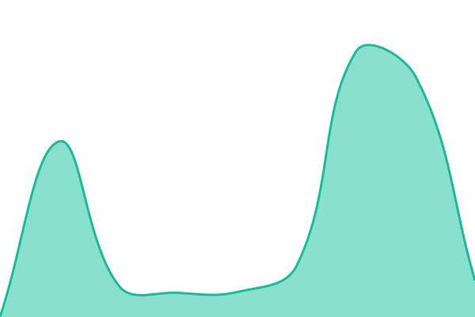
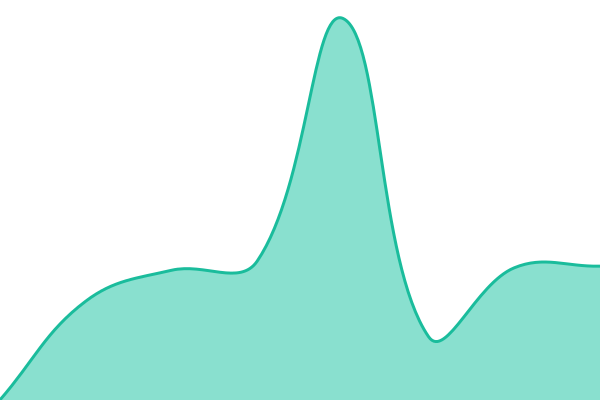
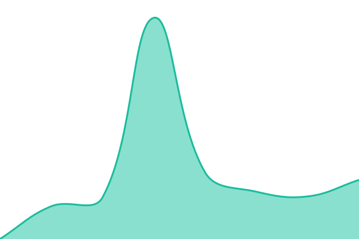
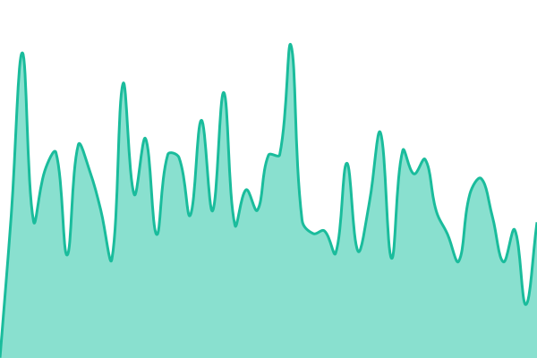
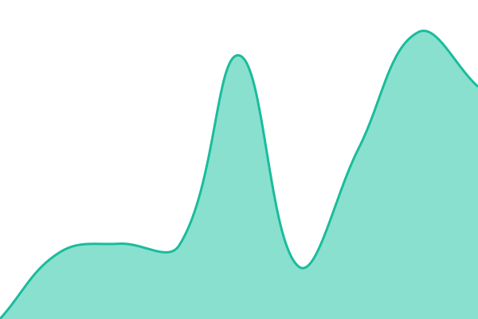

# [📈 Live Status](https://intus-as.github.io/Types-status/): <!--live status--> **🟧 Partial outage**

This repository contains the open-source uptime monitor and status page for [Upptime](https://upptime.js.org), powered by [Upptime](https://github.com/upptime/upptime).

With [Upptime](https://upptime.js.org), you can get your own unlimited and free uptime monitor and status page, powered entirely by a GitHub repository. We use [Issues](https://github.com/Intus-AS/Types-status/issues) as incident reports, [Actions](https://github.com/Intus-AS/Types-status/actions) as uptime monitors, and [Pages](https://intus-as.github.io/Types-status/) for the status page.

<!--start: status pages-->
<!-- This summary is generated by Upptime (https://github.com/upptime/upptime) -->
<!-- Do not edit this manually, your changes will be overwritten -->
<!-- prettier-ignore -->
| URL | Status | History | Response Time | Uptime |
| --- | ------ | ------- | ------------- | ------ |
|  [mardahl.no](https://mardahl.no) | 🟩 Up | [mardahl-no.yml](https://github.com/Intus-AS/Types-status/commits/HEAD/history/mardahl-no.yml) | 

 1018ms
     
 | 

<a href="https://Intus-AS.github.io/Types-status/history/mardahl-no">75.45%</a>
    

|  [verksted.mardahl.no](https://verksted.mardahl.no) | 🟩 Up | [verksted-mardahl-no.yml](https://github.com/Intus-AS/Types-status/commits/HEAD/history/verksted-mardahl-no.yml) | 

 1138ms
     
 | 

<a href="https://Intus-AS.github.io/Types-status/history/verksted-mardahl-no">75.45%</a>
    

|  [industri.mardahl.no](https://industri.mardahl.no) | 🟩 Up | [industri-mardahl-no.yml](https://github.com/Intus-AS/Types-status/commits/HEAD/history/industri-mardahl-no.yml) | 

 1148ms
     
 | 

<a href="https://Intus-AS.github.io/Types-status/history/industri-mardahl-no">75.45%</a>
    

|  [frumento.no](https://frumento.no) | 🟥 Down | [frumento-no.yml](https://github.com/Intus-AS/Types-status/commits/HEAD/history/frumento-no.yml) | 

 1698ms
     
 | 

<a href="https://Intus-AS.github.io/Types-status/history/frumento-no">80.21%</a>
    

|  [osteriamoderna.no](https://osteriamoderna.no) | 🟩 Up | [osteriamoderna-no.yml](https://github.com/Intus-AS/Types-status/commits/HEAD/history/osteriamoderna-no.yml) | 

 2188ms
     
 | 

<a href="https://Intus-AS.github.io/Types-status/history/osteriamoderna-no">99.20%</a>
    

|  [frostabrygge.no](https://frostabrygge.no) | 🟩 Up | [frostabrygge-no.yml](https://github.com/Intus-AS/Types-status/commits/HEAD/history/frostabrygge-no.yml) | 

 1564ms
     
 | 

<a href="https://Intus-AS.github.io/Types-status/history/frostabrygge-no">75.45%</a>
    

|  [yggdrasilmiljo.no](https://yggdrasilmiljo.no) | 🟩 Up | [yggdrasilmiljo-no.yml](https://github.com/Intus-AS/Types-status/commits/HEAD/history/yggdrasilmiljo-no.yml) | 

 2220ms
     
 | 

<a href="https://Intus-AS.github.io/Types-status/history/yggdrasilmiljo-no">75.45%</a>
    

|  [simonsinterior.no](https://simonsinterior.no) | 🟩 Up | [simonsinterior-no.yml](https://github.com/Intus-AS/Types-status/commits/HEAD/history/simonsinterior-no.yml) | 

 1308ms
     
 | 

<a href="https://Intus-AS.github.io/Types-status/history/simonsinterior-no">75.45%</a>
    

|  [leospizza.no](https://leospizza.no) | 🟩 Up | [leospizza-no.yml](https://github.com/Intus-AS/Types-status/commits/HEAD/history/leospizza-no.yml) | 

 864ms
     
 | 

<a href="https://Intus-AS.github.io/Types-status/history/leospizza-no">100.00%</a>
    

|  [xstadion.no](https://xstadion.no) | 🟥 Down | [xstadion-no.yml](https://github.com/Intus-AS/Types-status/commits/HEAD/history/xstadion-no.yml) | 

 0ms
     
 | 

<a href="https://Intus-AS.github.io/Types-status/history/xstadion-no">0.00%</a>
    

|  [dininfoskjerm.no](https://dininfoskjerm.no) | 🟩 Up | [dininfoskjerm-no.yml](https://github.com/Intus-AS/Types-status/commits/HEAD/history/dininfoskjerm-no.yml) | 

 1068ms
     
 | 

<a href="https://Intus-AS.github.io/Types-status/history/dininfoskjerm-no">75.45%</a>
    

|  [alpha-as.no](https://alpha-as.no) | 🟩 Up | [alpha-as-no.yml](https://github.com/Intus-AS/Types-status/commits/HEAD/history/alpha-as-no.yml) | 

 1202ms
     
 | 

<a href="https://Intus-AS.github.io/Types-status/history/alpha-as-no">75.45%</a>
    

|  [biztek.no](https://biztek.no) | 🟩 Up | [biztek-no.yml](https://github.com/Intus-AS/Types-status/commits/HEAD/history/biztek-no.yml) | 

 855ms
     
 | 

<a href="https://Intus-AS.github.io/Types-status/history/biztek-no">100.00%</a>
    

|  [lakksalg.no](https://lakksalg.no) | 🟩 Up | [lakksalg-no.yml](https://github.com/Intus-AS/Types-status/commits/HEAD/history/lakksalg-no.yml) | 

 1305ms
     
 | 

<a href="https://Intus-AS.github.io/Types-status/history/lakksalg-no">75.45%</a>
    

|  [ilfornaio.no](https://ilfornaio.no) | 🟩 Up | [ilfornaio-no.yml](https://github.com/Intus-AS/Types-status/commits/HEAD/history/ilfornaio-no.yml) | 

 2596ms
     
 | 

<a href="https://Intus-AS.github.io/Types-status/history/ilfornaio-no">75.45%</a>
    

|  [crispyfriedchicken.no](https://crispyfriedchicken.no) | 🟩 Up | [crispyfriedchicken-no.yml](https://github.com/Intus-AS/Types-status/commits/HEAD/history/crispyfriedchicken-no.yml) | 

 2244ms
     
 | 

<a href="https://Intus-AS.github.io/Types-status/history/crispyfriedchicken-no">100.00%</a>
    

|  [cfcdrive.no](https://cfcdrive.no) | 🟩 Up | [cfcdrive-no.yml](https://github.com/Intus-AS/Types-status/commits/HEAD/history/cfcdrive-no.yml) | 

 2847ms
     
 | 

<a href="https://Intus-AS.github.io/Types-status/history/cfcdrive-no">100.00%</a>
    

|  [nordingpartners.no](https://nordingpartners.no) | 🟩 Up | [nordingpartners-no.yml](https://github.com/Intus-AS/Types-status/commits/HEAD/history/nordingpartners-no.yml) | 

 1333ms
     
 | 

<a href="https://Intus-AS.github.io/Types-status/history/nordingpartners-no">100.00%</a>
    

|  [lokalskjermen.no](https://lokalskjermen.no) | 🟩 Up | [lokalskjermen-no.yml](https://github.com/Intus-AS/Types-status/commits/HEAD/history/lokalskjermen-no.yml) | 

 1131ms
     
 | 

<a href="https://Intus-AS.github.io/Types-status/history/lokalskjermen-no">75.45%</a>
    

|  [voldautospa.no](https://voldautospa.no) | 🟥 Down | [voldautospa-no.yml](https://github.com/Intus-AS/Types-status/commits/HEAD/history/voldautospa-no.yml) | 

 0ms
     
 | 

<a href="https://Intus-AS.github.io/Types-status/history/voldautospa-no">0.00%</a>
    

|  [types.no](https://types.no) | 🟥 Down | [types-no.yml](https://github.com/Intus-AS/Types-status/commits/HEAD/history/types-no.yml) | 

 0ms
     
 | 

<a href="https://Intus-AS.github.io/Types-status/history/types-no">0.00%</a>
    

|  [uniloq.io](https://uniloq.io) | 🟥 Down | [uniloq-io.yml](https://github.com/Intus-AS/Types-status/commits/HEAD/history/uniloq-io.yml) | 

 0ms
     
 | 

<a href="https://Intus-AS.github.io/Types-status/history/uniloq-io">0.00%</a>
    

|  [hotell-skolestua.no](https://hotell-skolestua.no) | 🟩 Up | [hotell-skolestua-no.yml](https://github.com/Intus-AS/Types-status/commits/HEAD/history/hotell-skolestua-no.yml) | 

 2953ms
     
 | 

<a href="https://Intus-AS.github.io/Types-status/history/hotell-skolestua-no">75.45%</a>
    

|  [meetly.no](https://meetly.no) | 🟥 Down | [meetly-no.yml](https://github.com/Intus-AS/Types-status/commits/HEAD/history/meetly-no.yml) | 

 517ms
     
 | 

<a href="https://Intus-AS.github.io/Types-status/history/meetly-no">0.00%</a>
    

|  [vikenmidtre.no](https://vikenmidtre.no) | 🟩 Up | [vikenmidtre-no.yml](https://github.com/Intus-AS/Types-status/commits/HEAD/history/vikenmidtre-no.yml) | 

 1368ms
     
 | 

<a href="https://Intus-AS.github.io/Types-status/history/vikenmidtre-no">75.46%</a>
    

|  [ck.no](https://ck.no) | 🟩 Up | [ck-no.yml](https://github.com/Intus-AS/Types-status/commits/HEAD/history/ck-no.yml) | 

 1025ms
     
 | 

<a href="https://Intus-AS.github.io/Types-status/history/ck-no">75.46%</a>
    

|  [trv-gruppen.ck.no](https://trv-gruppen.ck.no) | 🟩 Up | [trv-gruppen-ck-no.yml](https://github.com/Intus-AS/Types-status/commits/HEAD/history/trv-gruppen-ck-no.yml) | 

 3046ms
     
 | 

<a href="https://Intus-AS.github.io/Types-status/history/trv-gruppen-ck-no">75.45%</a>
    

|  [mederi.no](https://mederi.no) | 🟩 Up | [mederi-no.yml](https://github.com/Intus-AS/Types-status/commits/HEAD/history/mederi-no.yml) | 

 2575ms
     
 | 

<a href="https://Intus-AS.github.io/Types-status/history/mederi-no">75.45%</a>
    

|  [loginfinans.no](https://loginfinans.no) | 🟩 Up | [loginfinans-no.yml](https://github.com/Intus-AS/Types-status/commits/HEAD/history/loginfinans-no.yml) | 

 1099ms
     
 | 

<a href="https://Intus-AS.github.io/Types-status/history/loginfinans-no">100.00%</a>
    

|  [smålandbåtforening.no](https://smålandbåtforening.no) | 🟩 Up | [smalandbatforening-no.yml](https://github.com/Intus-AS/Types-status/commits/HEAD/history/smalandbatforening-no.yml) | 

 1838ms
     
 | 

<a href="https://Intus-AS.github.io/Types-status/history/smalandbatforening-no">75.45%</a>
    

|  [frent.no](https://frent.no) | 🟥 Down | [frent-no.yml](https://github.com/Intus-AS/Types-status/commits/HEAD/history/frent-no.yml) | 

 0ms
     
 | 

<a href="https://Intus-AS.github.io/Types-status/history/frent-no">0.00%</a>
    

|  [tilveksten.no](https://tilveksten.no) | 🟩 Up | [tilveksten-no.yml](https://github.com/Intus-AS/Types-status/commits/HEAD/history/tilveksten-no.yml) | 

 1175ms
     
 | 

<a href="https://Intus-AS.github.io/Types-status/history/tilveksten-no">75.46%</a>
    

|  [stem.hegrasparebank.no](https://stem.hegrasparebank.no) | 🟥 Down | [stem-hegrasparebank-no.yml](https://github.com/Intus-AS/Types-status/commits/HEAD/history/stem-hegrasparebank-no.yml) | 

 0ms
     
 | 

<a href="https://Intus-AS.github.io/Types-status/history/stem-hegrasparebank-no">0.00%</a>
    

|  [all-rf.no](https://all-rf.no) | 🟩 Up | [all-rf-no.yml](https://github.com/Intus-AS/Types-status/commits/HEAD/history/all-rf-no.yml) | 

 1038ms
     
 | 

<a href="https://Intus-AS.github.io/Types-status/history/all-rf-no">75.46%</a>
    

|  [mus.as](https://mus.as) | 🟩 Up | [mus-as.yml](https://github.com/Intus-AS/Types-status/commits/HEAD/history/mus-as.yml) | 

 394ms
     
 | 

<a href="https://Intus-AS.github.io/Types-status/history/mus-as">86.45%</a>
    

|  [all-ror.no](https://all-ror.no) | 🟩 Up | [all-ror-no.yml](https://github.com/Intus-AS/Types-status/commits/HEAD/history/all-ror-no.yml) | 

 1033ms
     
 | 

<a href="https://Intus-AS.github.io/Types-status/history/all-ror-no">75.46%</a>
    

|  [hojemgard.no](https://hojemgard.no) | 🟩 Up | [hojemgard-no.yml](https://github.com/Intus-AS/Types-status/commits/HEAD/history/hojemgard-no.yml) | 

 2213ms
     
 | 

<a href="https://Intus-AS.github.io/Types-status/history/hojemgard-no">75.46%</a>
    

|  [mariaskjokken.no](https://mariaskjokken.no) | 🟩 Up | [mariaskjokken-no.yml](https://github.com/Intus-AS/Types-status/commits/HEAD/history/mariaskjokken-no.yml) | 

 1050ms
     
 | 

<a href="https://Intus-AS.github.io/Types-status/history/mariaskjokken-no">75.46%</a>
    

|  [intus.no](https://intus.no) | 🟩 Up | [intus-no.yml](https://github.com/Intus-AS/Types-status/commits/HEAD/history/intus-no.yml) | 

 1276ms
     
 | 

<a href="https://Intus-AS.github.io/Types-status/history/intus-no">75.46%</a>
    

|  [roskaft.no](https://roskaft.no) | 🟩 Up | [roskaft-no.yml](https://github.com/Intus-AS/Types-status/commits/HEAD/history/roskaft-no.yml) | 

 1425ms
     
 | 

<a href="https://Intus-AS.github.io/Types-status/history/roskaft-no">75.46%</a>
    

|  [operadisetra.no](https://operadisetra.no) | 🟩 Up | [operadisetra-no.yml](https://github.com/Intus-AS/Types-status/commits/HEAD/history/operadisetra-no.yml) | 

 1479ms
     
 | 

<a href="https://Intus-AS.github.io/Types-status/history/operadisetra-no">75.46%</a>
    

|  [ppmprosjekt.no](https://ppmprosjekt.no) | 🟩 Up | [ppmprosjekt-no.yml](https://github.com/Intus-AS/Types-status/commits/HEAD/history/ppmprosjekt-no.yml) | 

 579ms
     
 | 

<a href="https://Intus-AS.github.io/Types-status/history/ppmprosjekt-no">100.00%</a>
    

|  [fossli.no](https://fossli.no) | 🟩 Up | [fossli-no.yml](https://github.com/Intus-AS/Types-status/commits/HEAD/history/fossli-no.yml) | 

 1333ms
     
 | 

<a href="https://Intus-AS.github.io/Types-status/history/fossli-no">75.46%</a>
    

|  [helgeposen.no](https://helgeposen.no) | 🟩 Up | [helgeposen-no.yml](https://github.com/Intus-AS/Types-status/commits/HEAD/history/helgeposen-no.yml) | 

 195ms
     
 | 

<a href="https://Intus-AS.github.io/Types-status/history/helgeposen-no">86.45%</a>
    

|  [djupvika.no](https://djupvika.no) | 🟩 Up | [djupvika-no.yml](https://github.com/Intus-AS/Types-status/commits/HEAD/history/djupvika-no.yml) | 

 556ms
     
 | 

<a href="https://Intus-AS.github.io/Types-status/history/djupvika-no">100.00%</a>
    

|  [smakenavspania.no](https://smakenavspania.no) | 🟩 Up | [smakenavspania-no.yml](https://github.com/Intus-AS/Types-status/commits/HEAD/history/smakenavspania-no.yml) | 

 226ms
     
 | 

<a href="https://Intus-AS.github.io/Types-status/history/smakenavspania-no">85.61%</a>
    

|  [krradgivning.no](https://krradgivning.no) | 🟩 Up | [krradgivning-no.yml](https://github.com/Intus-AS/Types-status/commits/HEAD/history/krradgivning-no.yml) | 

 1046ms
     
 | 

<a href="https://Intus-AS.github.io/Types-status/history/krradgivning-no">75.46%</a>
    

|  [turbuss1.no](https://turbuss1.no) | 🟩 Up | [turbuss1-no.yml](https://github.com/Intus-AS/Types-status/commits/HEAD/history/turbuss1-no.yml) | 

 1178ms
     
 | 

<a href="https://Intus-AS.github.io/Types-status/history/turbuss1-no">75.46%</a>
    

|  [utpaasjoen.no](https://utpaasjoen.no) | 🟥 Down | [utpaasjoen-no.yml](https://github.com/Intus-AS/Types-status/commits/HEAD/history/utpaasjoen-no.yml) | 

 0ms
     
 | 

<a href="https://Intus-AS.github.io/Types-status/history/utpaasjoen-no">0.00%</a>
    

|  [frostafrisor.no](https://frostafrisor.no) | 🟩 Up | [frostafrisor-no.yml](https://github.com/Intus-AS/Types-status/commits/HEAD/history/frostafrisor-no.yml) | 

 1687ms
     
 | 

<a href="https://Intus-AS.github.io/Types-status/history/frostafrisor-no">75.46%</a>
    

|  [hell-catering.no](https://hell-catering.no) | 🟩 Up | [hell-catering-no.yml](https://github.com/Intus-AS/Types-status/commits/HEAD/history/hell-catering-no.yml) | 

 368ms
     
 | 

<a href="https://Intus-AS.github.io/Types-status/history/hell-catering-no">86.45%</a>
    

|  [tobbdrift.no](https://tobbdrift.no) | 🟩 Up | [tobbdrift-no.yml](https://github.com/Intus-AS/Types-status/commits/HEAD/history/tobbdrift-no.yml) | 

 1124ms
     
 | 

<a href="https://Intus-AS.github.io/Types-status/history/tobbdrift-no">75.46%</a>
    

|  [klostergardentautra.no](https://klostergardentautra.no) | 🟩 Up | [klostergardentautra-no.yml](https://github.com/Intus-AS/Types-status/commits/HEAD/history/klostergardentautra-no.yml) | 

 2259ms
     
 | 

<a href="https://Intus-AS.github.io/Types-status/history/klostergardentautra-no">75.46%</a>
    

|  [venklinikken.no](https://venklinikken.no) | 🟩 Up | [venklinikken-no.yml](https://github.com/Intus-AS/Types-status/commits/HEAD/history/venklinikken-no.yml) | 

 1177ms
     
 | 

<a href="https://Intus-AS.github.io/Types-status/history/venklinikken-no">75.46%</a>
    

|  [frisk-salat.no](https://frisk-salat.no) | 🟩 Up | [frisk-salat-no.yml](https://github.com/Intus-AS/Types-status/commits/HEAD/history/frisk-salat-no.yml) | 

 419ms
     
 | 

<a href="https://Intus-AS.github.io/Types-status/history/frisk-salat-no">100.00%</a>
    

|  [portalenagdenes.no](https://portalenagdenes.no) | 🟩 Up | [portalenagdenes-no.yml](https://github.com/Intus-AS/Types-status/commits/HEAD/history/portalenagdenes-no.yml) | 

 1404ms
     
 | 

<a href="https://Intus-AS.github.io/Types-status/history/portalenagdenes-no">75.46%</a>
    

|  [xfitness.no](https://xfitness.no) | 🟩 Up | [xfitness-no.yml](https://github.com/Intus-AS/Types-status/commits/HEAD/history/xfitness-no.yml) | 

 540ms
     
 | 

<a href="https://Intus-AS.github.io/Types-status/history/xfitness-no">100.00%</a>
    

|  [eidum.no](https://eidum.no) | 🟩 Up | [eidum-no.yml](https://github.com/Intus-AS/Types-status/commits/HEAD/history/eidum-no.yml) | 

 801ms
     
 | 

<a href="https://Intus-AS.github.io/Types-status/history/eidum-no">99.54%</a>
    

|  [frostabua.no](https://frostabua.no) | 🟥 Down | [frostabua-no.yml](https://github.com/Intus-AS/Types-status/commits/HEAD/history/frostabua-no.yml) | 

 0ms
     
 | 

<a href="https://Intus-AS.github.io/Types-status/history/frostabua-no">0.00%</a>
    

|  [easyfit.no](https://easyfit.no) | 🟥 Down | [easyfit-no.yml](https://github.com/Intus-AS/Types-status/commits/HEAD/history/easyfit-no.yml) | 

 0ms
     
 | 

<a href="https://Intus-AS.github.io/Types-status/history/easyfit-no">0.00%</a>
    

|  [frostavvs.no](https://frostavvs.no) | 🟩 Up | [frostavvs-no.yml](https://github.com/Intus-AS/Types-status/commits/HEAD/history/frostavvs-no.yml) | 

 988ms
     
 | 

<a href="https://Intus-AS.github.io/Types-status/history/frostavvs-no">75.46%</a>
    

|  [grano.no](https://grano.no) | 🟩 Up | [grano-no.yml](https://github.com/Intus-AS/Types-status/commits/HEAD/history/grano-no.yml) | 

 2876ms
     
 | 

<a href="https://Intus-AS.github.io/Types-status/history/grano-no">99.21%</a>
    

|  [fallskjerm.no](https://fallskjerm.no) | 🟩 Up | [fallskjerm-no.yml](https://github.com/Intus-AS/Types-status/commits/HEAD/history/fallskjerm-no.yml) | 

 3222ms
     
 | 

<a href="https://Intus-AS.github.io/Types-status/history/fallskjerm-no">100.00%</a>
    

|  [vingemaskin.no](https://vingemaskin.no) | 🟥 Down | [vingemaskin-no.yml](https://github.com/Intus-AS/Types-status/commits/HEAD/history/vingemaskin-no.yml) | 

 1119ms
     
 | 

<a href="https://Intus-AS.github.io/Types-status/history/vingemaskin-no">75.47%</a>
    

|  [publy.no](https://publy.no) | 🟩 Up | [publy-no.yml](https://github.com/Intus-AS/Types-status/commits/HEAD/history/publy-no.yml) | 

 1466ms
     
 | 

<a href="https://Intus-AS.github.io/Types-status/history/publy-no">100.00%</a>
    

|  [app.publy.no](https://app.publy.no) | 🟩 Up | [app-publy-no.yml](https://github.com/Intus-AS/Types-status/commits/HEAD/history/app-publy-no.yml) | 

 377ms
     
 | 

<a href="https://Intus-AS.github.io/Types-status/history/app-publy-no">100.00%</a>
    

|  [partner.publy.no](https://partner.publy.no) | 🟩 Up | [partner-publy-no.yml](https://github.com/Intus-AS/Types-status/commits/HEAD/history/partner-publy-no.yml) | 

 263ms
     
 | 

<a href="https://Intus-AS.github.io/Types-status/history/partner-publy-no">100.00%</a>
    

|  [hammerplanteskole.no](https://hammerplanteskole.no) | 🟩 Up | [hammerplanteskole-no.yml](https://github.com/Intus-AS/Types-status/commits/HEAD/history/hammerplanteskole-no.yml) | 

 1288ms
     
 | 

<a href="https://Intus-AS.github.io/Types-status/history/hammerplanteskole-no">75.46%</a>
    

|  [hospitalet.no](https://hospitalet.no) | 🟩 Up | [hospitalet-no.yml](https://github.com/Intus-AS/Types-status/commits/HEAD/history/hospitalet-no.yml) | 

 1113ms
     
 | 

<a href="https://Intus-AS.github.io/Types-status/history/hospitalet-no">75.46%</a>
    

|  [stenets.no](https://stenets.no) | 🟩 Up | [stenets-no.yml](https://github.com/Intus-AS/Types-status/commits/HEAD/history/stenets-no.yml) | 

 2149ms
     
 | 

<a href="https://Intus-AS.github.io/Types-status/history/stenets-no">75.46%</a>
    

|  [orsand.no](https://orsand.no) | 🟩 Up | [orsand-no.yml](https://github.com/Intus-AS/Types-status/commits/HEAD/history/orsand-no.yml) | 

 2146ms
     
 | 

<a href="https://Intus-AS.github.io/Types-status/history/orsand-no">75.46%</a>
    

|  [minilagertrondheim.no](https://minilagertrondheim.no) | 🟩 Up | [minilagertrondheim-no.yml](https://github.com/Intus-AS/Types-status/commits/HEAD/history/minilagertrondheim-no.yml) | 

 2206ms
     
 | 

<a href="https://Intus-AS.github.io/Types-status/history/minilagertrondheim-no">75.46%</a>
    

<!--end: status pages-->

[**Visit our status website →**](https://intus-as.github.io/Types-status/)

## 📄 License

- Powered by: [Upptime](https://github.com/upptime/upptime)
- Code: [MIT](./LICENSE) © [Upptime](https://upptime.js.org)
- Data in the `./history` directory: [Open Database License](https://opendatacommons.org/licenses/odbl/1-0/)
