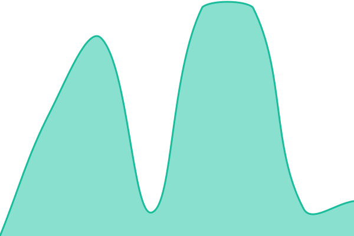
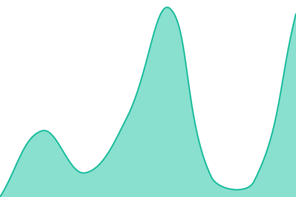
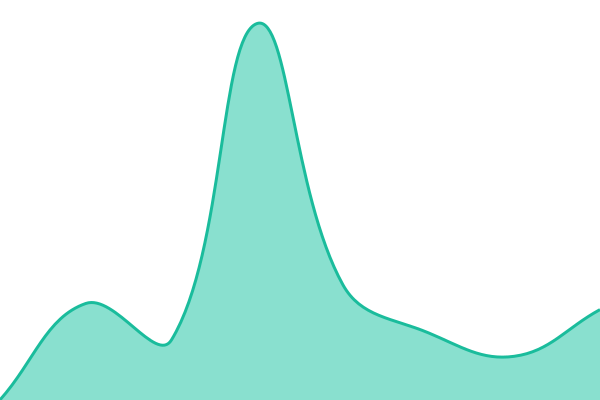
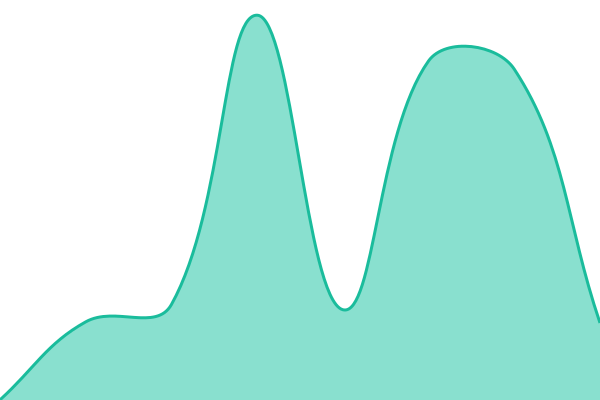
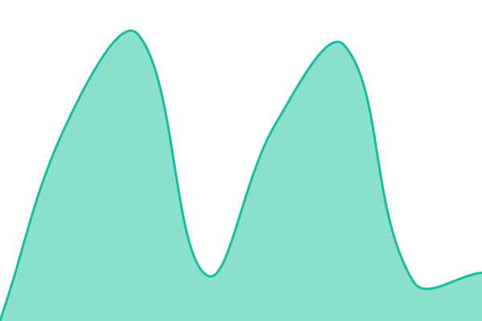

# [📈 Live Status](https://intus-as.github.io/Types-status/): <!--live status--> **🟧 Partial outage**

This repository contains the open-source uptime monitor and status page for [Upptime](https://upptime.js.org), powered by [Upptime](https://github.com/upptime/upptime).

With [Upptime](https://upptime.js.org), you can get your own unlimited and free uptime monitor and status page, powered entirely by a GitHub repository. We use [Issues](https://github.com/Intus-AS/Types-status/issues) as incident reports, [Actions](https://github.com/Intus-AS/Types-status/actions) as uptime monitors, and [Pages](https://intus-as.github.io/Types-status/) for the status page.

<!--start: status pages-->
<!-- This summary is generated by Upptime (https://github.com/upptime/upptime) -->
<!-- Do not edit this manually, your changes will be overwritten -->
<!-- prettier-ignore -->
| URL | Status | History | Response Time | Uptime |
| --- | ------ | ------- | ------------- | ------ |
|  [mardahl.no](https://mardahl.no) | 🟩 Up | [mardahl-no.yml](https://github.com/Intus-AS/Types-status/commits/HEAD/history/mardahl-no.yml) | 

 898ms
     
 | 

<a href="https://Intus-AS.github.io/Types-status/history/mardahl-no">94.46%</a>
    

|  [verksted.mardahl.no](https://verksted.mardahl.no) | 🟩 Up | [verksted-mardahl-no.yml](https://github.com/Intus-AS/Types-status/commits/HEAD/history/verksted-mardahl-no.yml) | 

 883ms
     
 | 

<a href="https://Intus-AS.github.io/Types-status/history/verksted-mardahl-no">94.56%</a>
    

|  [industri.mardahl.no](https://industri.mardahl.no) | 🟩 Up | [industri-mardahl-no.yml](https://github.com/Intus-AS/Types-status/commits/HEAD/history/industri-mardahl-no.yml) | 

 888ms
     
 | 

<a href="https://Intus-AS.github.io/Types-status/history/industri-mardahl-no">94.65%</a>
    

|  [frumento.no](https://frumento.no) | 🟩 Up | [frumento-no.yml](https://github.com/Intus-AS/Types-status/commits/HEAD/history/frumento-no.yml) | 

 2380ms
     
 | 

<a href="https://Intus-AS.github.io/Types-status/history/frumento-no">93.82%</a>
    

|  [osteriamoderna.no](https://osteriamoderna.no) | 🟩 Up | [osteriamoderna-no.yml](https://github.com/Intus-AS/Types-status/commits/HEAD/history/osteriamoderna-no.yml) | 

 3027ms
     
 | 

<a href="https://Intus-AS.github.io/Types-status/history/osteriamoderna-no">100.00%</a>
    

|  [frostabrygge.no](https://frostabrygge.no) | 🟩 Up | [frostabrygge-no.yml](https://github.com/Intus-AS/Types-status/commits/HEAD/history/frostabrygge-no.yml) | 

 1337ms
     
 | 

<a href="https://Intus-AS.github.io/Types-status/history/frostabrygge-no">94.75%</a>
    

|  [yggdrasilmiljo.no](https://yggdrasilmiljo.no) | 🟩 Up | [yggdrasilmiljo-no.yml](https://github.com/Intus-AS/Types-status/commits/HEAD/history/yggdrasilmiljo-no.yml) | 

 1484ms
     
 | 

<a href="https://Intus-AS.github.io/Types-status/history/yggdrasilmiljo-no">94.85%</a>
    

|  [simonsinterior.no](https://simonsinterior.no) | 🟩 Up | [simonsinterior-no.yml](https://github.com/Intus-AS/Types-status/commits/HEAD/history/simonsinterior-no.yml) | 

 1246ms
     
 | 

<a href="https://Intus-AS.github.io/Types-status/history/simonsinterior-no">94.95%</a>
    

|  [leospizza.no](https://leospizza.no) | 🟩 Up | [leospizza-no.yml](https://github.com/Intus-AS/Types-status/commits/HEAD/history/leospizza-no.yml) | 

 858ms
     
 | 

<a href="https://Intus-AS.github.io/Types-status/history/leospizza-no">100.00%</a>
    

|  [xstadion.no](https://xstadion.no) | 🟥 Down | [xstadion-no.yml](https://github.com/Intus-AS/Types-status/commits/HEAD/history/xstadion-no.yml) | 

 0ms
     
 | 

<a href="https://Intus-AS.github.io/Types-status/history/xstadion-no">0.00%</a>
    

|  [dininfoskjerm.no](https://dininfoskjerm.no) | 🟩 Up | [dininfoskjerm-no.yml](https://github.com/Intus-AS/Types-status/commits/HEAD/history/dininfoskjerm-no.yml) | 

 963ms
     
 | 

<a href="https://Intus-AS.github.io/Types-status/history/dininfoskjerm-no">95.04%</a>
    

|  [alpha-as.no](https://alpha-as.no) | 🟩 Up | [alpha-as-no.yml](https://github.com/Intus-AS/Types-status/commits/HEAD/history/alpha-as-no.yml) | 

 867ms
     
 | 

<a href="https://Intus-AS.github.io/Types-status/history/alpha-as-no">95.14%</a>
    

|  [biztek.no](https://biztek.no) | 🟩 Up | [biztek-no.yml](https://github.com/Intus-AS/Types-status/commits/HEAD/history/biztek-no.yml) | 

 711ms
     
 | 

<a href="https://Intus-AS.github.io/Types-status/history/biztek-no">100.00%</a>
    

|  [lakksalg.no](https://lakksalg.no) | 🟩 Up | [lakksalg-no.yml](https://github.com/Intus-AS/Types-status/commits/HEAD/history/lakksalg-no.yml) | 

 950ms
     
 | 

<a href="https://Intus-AS.github.io/Types-status/history/lakksalg-no">95.23%</a>
    

|  [ilfornaio.no](https://ilfornaio.no) | 🟩 Up | [ilfornaio-no.yml](https://github.com/Intus-AS/Types-status/commits/HEAD/history/ilfornaio-no.yml) | 

 1711ms
     
 | 

<a href="https://Intus-AS.github.io/Types-status/history/ilfornaio-no">95.33%</a>
    

|  [crispyfriedchicken.no](https://crispyfriedchicken.no) | 🟩 Up | [crispyfriedchicken-no.yml](https://github.com/Intus-AS/Types-status/commits/HEAD/history/crispyfriedchicken-no.yml) | 

 1919ms
     
 | 

<a href="https://Intus-AS.github.io/Types-status/history/crispyfriedchicken-no">100.00%</a>
    

|  [cfcdrive.no](https://cfcdrive.no) | 🟩 Up | [cfcdrive-no.yml](https://github.com/Intus-AS/Types-status/commits/HEAD/history/cfcdrive-no.yml) | 

 3979ms
     
 | 

<a href="https://Intus-AS.github.io/Types-status/history/cfcdrive-no">93.77%</a>
    

|  [nordingpartners.no](https://nordingpartners.no) | 🟩 Up | [nordingpartners-no.yml](https://github.com/Intus-AS/Types-status/commits/HEAD/history/nordingpartners-no.yml) | 

 1368ms
     
 | 

<a href="https://Intus-AS.github.io/Types-status/history/nordingpartners-no">100.00%</a>
    

|  [lokalskjermen.no](https://lokalskjermen.no) | 🟥 Down | [lokalskjermen-no.yml](https://github.com/Intus-AS/Types-status/commits/HEAD/history/lokalskjermen-no.yml) | 

 0ms
     
 | 

<a href="https://Intus-AS.github.io/Types-status/history/lokalskjermen-no">0.00%</a>
    

|  [voldautospa.no](https://voldautospa.no) | 🟥 Down | [voldautospa-no.yml](https://github.com/Intus-AS/Types-status/commits/HEAD/history/voldautospa-no.yml) | 

 0ms
     
 | 

<a href="https://Intus-AS.github.io/Types-status/history/voldautospa-no">0.00%</a>
    

|  [types.no](https://types.no) | 🟥 Down | [types-no.yml](https://github.com/Intus-AS/Types-status/commits/HEAD/history/types-no.yml) | 

 0ms
     
 | 

<a href="https://Intus-AS.github.io/Types-status/history/types-no">0.00%</a>
    

|  [uniloq.io](https://uniloq.io) | 🟥 Down | [uniloq-io.yml](https://github.com/Intus-AS/Types-status/commits/HEAD/history/uniloq-io.yml) | 

 11320ms
     
 | 

<a href="https://Intus-AS.github.io/Types-status/history/uniloq-io">8.71%</a>
    

|  [hotell-skolestua.no](https://hotell-skolestua.no) | 🟩 Up | [hotell-skolestua-no.yml](https://github.com/Intus-AS/Types-status/commits/HEAD/history/hotell-skolestua-no.yml) | 

 1861ms
     
 | 

<a href="https://Intus-AS.github.io/Types-status/history/hotell-skolestua-no">95.52%</a>
    

|  [meetly.no](https://meetly.no) | 🟩 Up | [meetly-no.yml](https://github.com/Intus-AS/Types-status/commits/HEAD/history/meetly-no.yml) | 

 999ms
     
 | 

<a href="https://Intus-AS.github.io/Types-status/history/meetly-no">100.00%</a>
    

|  [vikenmidtre.no](https://vikenmidtre.no) | 🟩 Up | [vikenmidtre-no.yml](https://github.com/Intus-AS/Types-status/commits/HEAD/history/vikenmidtre-no.yml) | 

 1089ms
     
 | 

<a href="https://Intus-AS.github.io/Types-status/history/vikenmidtre-no">95.62%</a>
    

|  [ck.no](https://ck.no) | 🟩 Up | [ck-no.yml](https://github.com/Intus-AS/Types-status/commits/HEAD/history/ck-no.yml) | 

 712ms
     
 | 

<a href="https://Intus-AS.github.io/Types-status/history/ck-no">95.71%</a>
    

|  [trv-gruppen.ck.no](https://trv-gruppen.ck.no) | 🟩 Up | [trv-gruppen-ck-no.yml](https://github.com/Intus-AS/Types-status/commits/HEAD/history/trv-gruppen-ck-no.yml) | 

 2797ms
     
 | 

<a href="https://Intus-AS.github.io/Types-status/history/trv-gruppen-ck-no">95.81%</a>
    

|  [mederi.no](https://mederi.no) | 🟩 Up | [mederi-no.yml](https://github.com/Intus-AS/Types-status/commits/HEAD/history/mederi-no.yml) | 

 663ms
     
 | 

<a href="https://Intus-AS.github.io/Types-status/history/mederi-no">100.00%</a>
    

|  [loginfinans.no](https://loginfinans.no) | 🟩 Up | [loginfinans-no.yml](https://github.com/Intus-AS/Types-status/commits/HEAD/history/loginfinans-no.yml) | 

 1219ms
     
 | 

<a href="https://Intus-AS.github.io/Types-status/history/loginfinans-no">100.00%</a>
    

|  [smålandbåtforening.no](https://smålandbåtforening.no) | 🟩 Up | [smalandbatforening-no.yml](https://github.com/Intus-AS/Types-status/commits/HEAD/history/smalandbatforening-no.yml) | 

 1227ms
     
 | 

<a href="https://Intus-AS.github.io/Types-status/history/smalandbatforening-no">95.90%</a>
    

|  [frent.no](https://frent.no) | 🟥 Down | [frent-no.yml](https://github.com/Intus-AS/Types-status/commits/HEAD/history/frent-no.yml) | 

 0ms
     
 | 

<a href="https://Intus-AS.github.io/Types-status/history/frent-no">0.00%</a>
    

|  [tilveksten.no](https://tilveksten.no) | 🟩 Up | [tilveksten-no.yml](https://github.com/Intus-AS/Types-status/commits/HEAD/history/tilveksten-no.yml) | 

 1364ms
     
 | 

<a href="https://Intus-AS.github.io/Types-status/history/tilveksten-no">96.09%</a>
    

|  [stem.hegrasparebank.no](https://stem.hegrasparebank.no) | 🟥 Down | [stem-hegrasparebank-no.yml](https://github.com/Intus-AS/Types-status/commits/HEAD/history/stem-hegrasparebank-no.yml) | 

 0ms
     
 | 

<a href="https://Intus-AS.github.io/Types-status/history/stem-hegrasparebank-no">0.00%</a>
    

|  [all-rf.no](https://all-rf.no) | 🟩 Up | [all-rf-no.yml](https://github.com/Intus-AS/Types-status/commits/HEAD/history/all-rf-no.yml) | 

 825ms
     
 | 

<a href="https://Intus-AS.github.io/Types-status/history/all-rf-no">96.19%</a>
    

|  [mus.as](https://mus.as) | 🟩 Up | [mus-as.yml](https://github.com/Intus-AS/Types-status/commits/HEAD/history/mus-as.yml) | 

 375ms
     
 | 

<a href="https://Intus-AS.github.io/Types-status/history/mus-as">100.00%</a>
    

|  [all-ror.no](https://all-ror.no) | 🟩 Up | [all-ror-no.yml](https://github.com/Intus-AS/Types-status/commits/HEAD/history/all-ror-no.yml) | 

 1199ms
     
 | 

<a href="https://Intus-AS.github.io/Types-status/history/all-ror-no">96.28%</a>
    

|  [hojemgard.no](https://hojemgard.no) | 🟩 Up | [hojemgard-no.yml](https://github.com/Intus-AS/Types-status/commits/HEAD/history/hojemgard-no.yml) | 

 1795ms
     
 | 

<a href="https://Intus-AS.github.io/Types-status/history/hojemgard-no">96.38%</a>
    

|  [mariaskjokken.no](https://mariaskjokken.no) | 🟩 Up | [mariaskjokken-no.yml](https://github.com/Intus-AS/Types-status/commits/HEAD/history/mariaskjokken-no.yml) | 

 836ms
     
 | 

<a href="https://Intus-AS.github.io/Types-status/history/mariaskjokken-no">96.48%</a>
    

|  [intus.no](https://intus.no) | 🟩 Up | [intus-no.yml](https://github.com/Intus-AS/Types-status/commits/HEAD/history/intus-no.yml) | 

 793ms
     
 | 

<a href="https://Intus-AS.github.io/Types-status/history/intus-no">96.57%</a>
    

|  [roskaft.no](https://roskaft.no) | 🟩 Up | [roskaft-no.yml](https://github.com/Intus-AS/Types-status/commits/HEAD/history/roskaft-no.yml) | 

 1144ms
     
 | 

<a href="https://Intus-AS.github.io/Types-status/history/roskaft-no">96.67%</a>
    

|  [operadisetra.no](https://operadisetra.no) | 🟩 Up | [operadisetra-no.yml](https://github.com/Intus-AS/Types-status/commits/HEAD/history/operadisetra-no.yml) | 

 1007ms
     
 | 

<a href="https://Intus-AS.github.io/Types-status/history/operadisetra-no">96.76%</a>
    

|  [ppmprosjekt.no](https://ppmprosjekt.no) | 🟩 Up | [ppmprosjekt-no.yml](https://github.com/Intus-AS/Types-status/commits/HEAD/history/ppmprosjekt-no.yml) | 

 397ms
     
 | 

<a href="https://Intus-AS.github.io/Types-status/history/ppmprosjekt-no">100.00%</a>
    

|  [fossli.no](https://fossli.no) | 🟩 Up | [fossli-no.yml](https://github.com/Intus-AS/Types-status/commits/HEAD/history/fossli-no.yml) | 

 816ms
     
 | 

<a href="https://Intus-AS.github.io/Types-status/history/fossli-no">96.86%</a>
    

|  [helgeposen.no](https://helgeposen.no) | 🟩 Up | [helgeposen-no.yml](https://github.com/Intus-AS/Types-status/commits/HEAD/history/helgeposen-no.yml) | 

 226ms
     
 | 

<a href="https://Intus-AS.github.io/Types-status/history/helgeposen-no">100.00%</a>
    

|  [djupvika.no](https://djupvika.no) | 🟩 Up | [djupvika-no.yml](https://github.com/Intus-AS/Types-status/commits/HEAD/history/djupvika-no.yml) | 

 441ms
     
 | 

<a href="https://Intus-AS.github.io/Types-status/history/djupvika-no">100.00%</a>
    

|  [smakenavspania.no](https://smakenavspania.no) | 🟩 Up | [smakenavspania-no.yml](https://github.com/Intus-AS/Types-status/commits/HEAD/history/smakenavspania-no.yml) | 

 234ms
     
 | 

<a href="https://Intus-AS.github.io/Types-status/history/smakenavspania-no">100.00%</a>
    

|  [krradgivning.no](https://krradgivning.no) | 🟩 Up | [krradgivning-no.yml](https://github.com/Intus-AS/Types-status/commits/HEAD/history/krradgivning-no.yml) | 

 1186ms
     
 | 

<a href="https://Intus-AS.github.io/Types-status/history/krradgivning-no">96.96%</a>
    

|  [turbuss1.no](https://turbuss1.no) | 🟩 Up | [turbuss1-no.yml](https://github.com/Intus-AS/Types-status/commits/HEAD/history/turbuss1-no.yml) | 

 1083ms
     
 | 

<a href="https://Intus-AS.github.io/Types-status/history/turbuss1-no">97.05%</a>
    

|  [utpaasjoen.no](https://utpaasjoen.no) | 🟥 Down | [utpaasjoen-no.yml](https://github.com/Intus-AS/Types-status/commits/HEAD/history/utpaasjoen-no.yml) | 

 0ms
     
 | 

<a href="https://Intus-AS.github.io/Types-status/history/utpaasjoen-no">0.00%</a>
    

|  [frostafrisor.no](https://frostafrisor.no) | 🟩 Up | [frostafrisor-no.yml](https://github.com/Intus-AS/Types-status/commits/HEAD/history/frostafrisor-no.yml) | 

 1118ms
     
 | 

<a href="https://Intus-AS.github.io/Types-status/history/frostafrisor-no">97.15%</a>
    

|  [hell-catering.no](https://hell-catering.no) | 🟩 Up | [hell-catering-no.yml](https://github.com/Intus-AS/Types-status/commits/HEAD/history/hell-catering-no.yml) | 

 389ms
     
 | 

<a href="https://Intus-AS.github.io/Types-status/history/hell-catering-no">100.00%</a>
    

|  [tobbdrift.no](https://tobbdrift.no) | 🟩 Up | [tobbdrift-no.yml](https://github.com/Intus-AS/Types-status/commits/HEAD/history/tobbdrift-no.yml) | 

 1524ms
     
 | 

<a href="https://Intus-AS.github.io/Types-status/history/tobbdrift-no">97.24%</a>
    

|  [klostergardentautra.no](https://klostergardentautra.no) | 🟩 Up | [klostergardentautra-no.yml](https://github.com/Intus-AS/Types-status/commits/HEAD/history/klostergardentautra-no.yml) | 

 1729ms
     
 | 

<a href="https://Intus-AS.github.io/Types-status/history/klostergardentautra-no">97.34%</a>
    

|  [venklinikken.no](https://venklinikken.no) | 🟩 Up | [venklinikken-no.yml](https://github.com/Intus-AS/Types-status/commits/HEAD/history/venklinikken-no.yml) | 

 922ms
     
 | 

<a href="https://Intus-AS.github.io/Types-status/history/venklinikken-no">97.44%</a>
    

|  [frisk-salat.no](https://frisk-salat.no) | 🟩 Up | [frisk-salat-no.yml](https://github.com/Intus-AS/Types-status/commits/HEAD/history/frisk-salat-no.yml) | 

 434ms
     
 | 

<a href="https://Intus-AS.github.io/Types-status/history/frisk-salat-no">100.00%</a>
    

|  [portalenagdenes.no](https://portalenagdenes.no) | 🟥 Down | [portalenagdenes-no.yml](https://github.com/Intus-AS/Types-status/commits/HEAD/history/portalenagdenes-no.yml) | 

 0ms
     
 | 

<a href="https://Intus-AS.github.io/Types-status/history/portalenagdenes-no">0.00%</a>
    

|  [xfitness.no](https://xfitness.no) | 🟩 Up | [xfitness-no.yml](https://github.com/Intus-AS/Types-status/commits/HEAD/history/xfitness-no.yml) | 

 536ms
     
 | 

<a href="https://Intus-AS.github.io/Types-status/history/xfitness-no">100.00%</a>
    

|  [eidum.no](https://eidum.no) | 🟩 Up | [eidum-no.yml](https://github.com/Intus-AS/Types-status/commits/HEAD/history/eidum-no.yml) | 

 876ms
     
 | 

<a href="https://Intus-AS.github.io/Types-status/history/eidum-no">100.00%</a>
    

|  [frostabua.no](https://frostabua.no) | 🟥 Down | [frostabua-no.yml](https://github.com/Intus-AS/Types-status/commits/HEAD/history/frostabua-no.yml) | 

 0ms
     
 | 

<a href="https://Intus-AS.github.io/Types-status/history/frostabua-no">0.00%</a>
    

|  [easyfit.no](https://easyfit.no) | 🟥 Down | [easyfit-no.yml](https://github.com/Intus-AS/Types-status/commits/HEAD/history/easyfit-no.yml) | 

 0ms
     
 | 

<a href="https://Intus-AS.github.io/Types-status/history/easyfit-no">0.00%</a>
    

|  [frostavvs.no](https://frostavvs.no) | 🟩 Up | [frostavvs-no.yml](https://github.com/Intus-AS/Types-status/commits/HEAD/history/frostavvs-no.yml) | 

 803ms
     
 | 

<a href="https://Intus-AS.github.io/Types-status/history/frostavvs-no">97.72%</a>
    

|  [grano.no](https://grano.no) | 🟩 Up | [grano-no.yml](https://github.com/Intus-AS/Types-status/commits/HEAD/history/grano-no.yml) | 

 1049ms
     
 | 

<a href="https://Intus-AS.github.io/Types-status/history/grano-no">100.00%</a>
    

|  [fallskjerm.no](https://fallskjerm.no) | 🟩 Up | [fallskjerm-no.yml](https://github.com/Intus-AS/Types-status/commits/HEAD/history/fallskjerm-no.yml) | 

 3687ms
     
 | 

<a href="https://Intus-AS.github.io/Types-status/history/fallskjerm-no">100.00%</a>
    

|  [vingemaskin.no](https://vingemaskin.no) | 🟩 Up | [vingemaskin-no.yml](https://github.com/Intus-AS/Types-status/commits/HEAD/history/vingemaskin-no.yml) | 

 3057ms
     
 | 

<a href="https://Intus-AS.github.io/Types-status/history/vingemaskin-no">96.88%</a>
    

|  [publy.no](https://publy.no) | 🟩 Up | [publy-no.yml](https://github.com/Intus-AS/Types-status/commits/HEAD/history/publy-no.yml) | 

 781ms
     
 | 

<a href="https://Intus-AS.github.io/Types-status/history/publy-no">100.00%</a>
    

|  [app.publy.no](https://app.publy.no) | 🟩 Up | [app-publy-no.yml](https://github.com/Intus-AS/Types-status/commits/HEAD/history/app-publy-no.yml) | 

 393ms
     
 | 

<a href="https://Intus-AS.github.io/Types-status/history/app-publy-no">100.00%</a>
    

|  [partner.publy.no](https://partner.publy.no) | 🟩 Up | [partner-publy-no.yml](https://github.com/Intus-AS/Types-status/commits/HEAD/history/partner-publy-no.yml) | 

 245ms
     
 | 

<a href="https://Intus-AS.github.io/Types-status/history/partner-publy-no">100.00%</a>
    

|  [hammerplanteskole.no](https://hammerplanteskole.no) | 🟩 Up | [hammerplanteskole-no.yml](https://github.com/Intus-AS/Types-status/commits/HEAD/history/hammerplanteskole-no.yml) | 

 935ms
     
 | 

<a href="https://Intus-AS.github.io/Types-status/history/hammerplanteskole-no">97.82%</a>
    

|  [hospitalet.no](https://hospitalet.no) | 🟩 Up | [hospitalet-no.yml](https://github.com/Intus-AS/Types-status/commits/HEAD/history/hospitalet-no.yml) | 

 839ms
     
 | 

<a href="https://Intus-AS.github.io/Types-status/history/hospitalet-no">97.91%</a>
    

|  [stenets.no](https://stenets.no) | 🟩 Up | [stenets-no.yml](https://github.com/Intus-AS/Types-status/commits/HEAD/history/stenets-no.yml) | 

 952ms
     
 | 

<a href="https://Intus-AS.github.io/Types-status/history/stenets-no">8.51%</a>
    

|  [orsand.no](https://orsand.no) | 🟩 Up | [orsand-no.yml](https://github.com/Intus-AS/Types-status/commits/HEAD/history/orsand-no.yml) | 

 2338ms
     
 | 

<a href="https://Intus-AS.github.io/Types-status/history/orsand-no">98.10%</a>
    

|  [minilagertrondheim.no](https://minilagertrondheim.no) | 🟩 Up | [minilagertrondheim-no.yml](https://github.com/Intus-AS/Types-status/commits/HEAD/history/minilagertrondheim-no.yml) | 

 1437ms
     
 | 

<a href="https://Intus-AS.github.io/Types-status/history/minilagertrondheim-no">98.20%</a>
    

<!--end: status pages-->

[**Visit our status website →**](https://intus-as.github.io/Types-status/)

## 📄 License

- Powered by: [Upptime](https://github.com/upptime/upptime)
- Code: [MIT](./LICENSE) © [Upptime](https://upptime.js.org)
- Data in the `./history` directory: [Open Database License](https://opendatacommons.org/licenses/odbl/1-0/)
